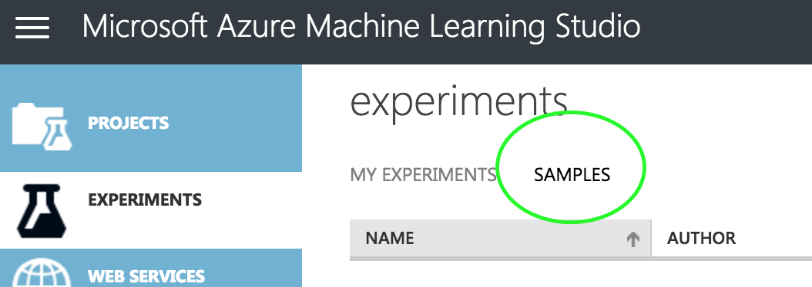

# Modeling
Before we wire up various modeling frameworks, let's consider one important topic **evaluation**. Up until now, you've played
with the data set `diabetic-deliver`. What I haven't told you is that part of that data set was held back for validating
everyone's model at the end of this exercise. In fact, 30% of the data has been held back. This will help us quantitatively
determine how well the models perform (and are generalizable). Before digging into modeling, it's helpful to first consider
what metic will be used to determine performance. For this exercise it will be `AUC`.

### Getting Started
Again, as this step is part of this exercise, this file will only demonstrate how to access tools and not necessarily demonstrate
modeling our data.

1. Check out other experiments. Viewing these boilerplate experiments, you can both get ideas for models as
well as see how features were connected.

2. Consider heterogeneous models (linear regression vs. decision trees).
3. Consider combining models.
4. Consider splitting feature data set, so that you can evaluate your models.
5. Once you've developed a machine learning pipeline, don't forget to click save!

### Submitting your work
When complete, you will submit your work by creating a web service and sharing the corresponding URL + APIKey. Here is 
how we will do that.

1. Once you are happy with your model and are ready to submit it to the competition, click `SET UP WEB SERVICE` at the 
bottom of the screen. Then `CREATE PREDICITVE EXPERIMENT`.
2. Once complete, click `RUN`.
3. Next, click `DEPLOY WEB SERVICE`.
4. On the left-hand side of the screen click the globe icon (i.e. `Web services`).
5. Now choose the web service that you just created.
6. From this screen, copy the API key and then paste it into this [google sheet](https://docs.google.com/spreadsheets/d/1HAn2Tl8TEsYmehRPeXEmfQ5LdIsIDXjIHVMJzj868Rw/edit?usp=sharing) where your name is located.
7. Now go back to the web service screen and click `BATCH EXECUTION`.
8. Scroll down to the section that says Sample Code and choose the `python` tab.
9. Once selected, scroll down into the code to a function called `invokeBatchExecutionService`.
10. Within that function there will be an attributed called `url`, copy the text **between** the double quotes and paste into
the google sheet linked above.
11. You've now submitted your model

Once you've followed these instructions, please take a minute to fill
out the following [google worksheet](https://docs.google.com/spreadsheets/d/1HAn2Tl8TEsYmehRPeXEmfQ5LdIsIDXjIHVMJzj868Rw/edit?usp=sharing).
Once everyone has submitted their work, we will start use an in-house application ([ENOUGH](https://github.com/benneely/ENOUGH)) to compare
everyone's work.